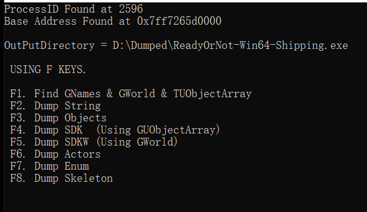

# UE4-Dumper
A modified version of UE4 Dumper, added some features...

Only versions after UE4.23 are supported.

This project is based on [https://github.com/RealAscarre/UE4-Dumper] and has added the following features:
- [DMA supported]
- [Find GName & GWorld & TUObjectArray (Not 100% successful)]
- [Dump enum]
- [Dump Skeleton]
- [Pretty output]

